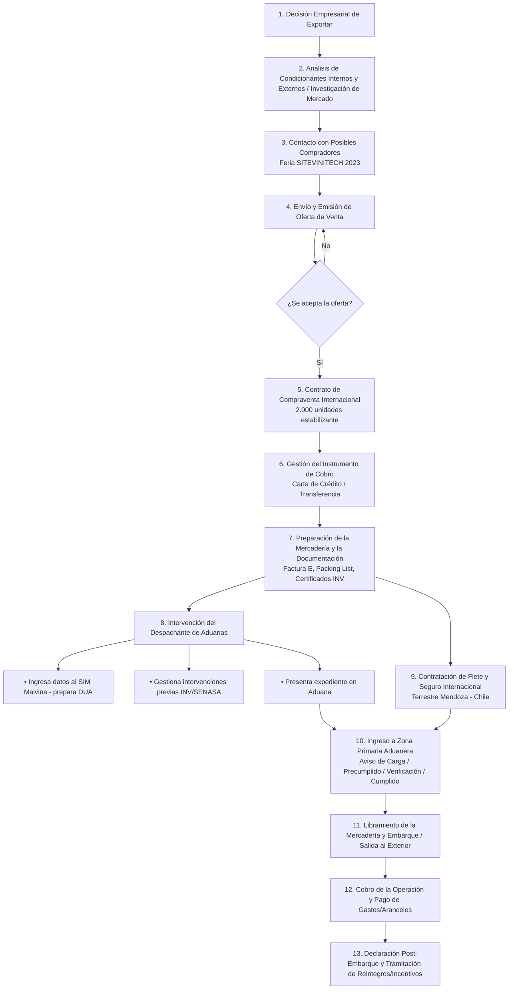

# Resolución de la Actividad Práctica: Exportación

**Asignatura:** Comercio Exterior  
**Unidad/Módulo:** Módulo V – Exportación  
**Caso Práctico:** Quimic del Sol SRL – Exportación a Chile  

---

## Situación Planteada
La Empresa **Quimic del Sol SRL**, dedicada a la producción de insumos y maquinarias para la industria vitivinícola, ha participado recientemente de la Feria SITEVINITECH 2023 y tomó la decisión de comercializar internacionalmente algunos de sus productos. En esta feria contactó empresas interesadas y la semana pasada recibió un pedido desde Chile por **2.000 unidades de producto estabilizante de vinos espumantes**.

---

## 1. Esquema con los Factores a Considerar Previamente a Exportar

Antes de iniciar la operatoria de exportación, la empresa debe analizar de manera rigurosa una serie de **condicionantes internos (endógenos)** y **externos (exógenos)** para asegurar la factibilidad operativa y económica del proyecto (Módulo V, Pág. 4, 20-21).

### Esquema Conceptual de Factores Previs

```mermaid
flowchart TD
    A[Decisión Estratégica de Exportar] --> B[Factores Internos / Empresa]
    A --> C[Factores Externos / Mercado Chile]
    
    B --> B1[Capacidad Productiva e Infraestructura<br/>Excedente exportable sin desatender mercado local]
    B --> B2[Capacidad Financiera y Flujo de Caja<br/>Plazos de cobro, costos logísticos e inversión inicial]
    B --> B3[Estructura de Costos y Precio Mínimo<br/>Costos fijos, variables y cálculo del FOB teórico]
    B --> B4[Adaptación de Producto y Calidad<br/>Estándares enológicos y especificaciones técnicas]
    B --> B5[Recursos Humanos y Capacitación<br/>Experiencia en normativa y gestión de Comercio Exterior]

    C --> C1[Investigación de Mercado Destino<br/>Demanda vitivinícola chilena y competencia]
    C --> C2[Normativa y Acceso a Mercado<br/>Barreras arancelarias (ACE 35) y exigencias del SAG]
    C --> C3[Estrategia de Inserción y Canal<br/>Venta directa, distribuidor o representante]
    C --> C4[Logística y Cadena de Transporte<br/>Ruta terrestre Mendoza-Chile (Paso Los Libertadores)]
    C --> C5[Riesgos y Medios de Cobro<br/>Instrumentos de cobro seguro y riesgo cambiario]
```

#### Resumen de Factores Clave:
* **Condicionantes Internos:** Evaluación del excedente exportable de la empresa, costo de producción (absorción vs. marginal), requerimientos de financiamiento, acondicionamiento del estabilizante (envases, etiquetado) y experiencia del personal.
* **Condicionantes Externos:** Normativa fitosanitaria/enológica en Chile, competencia directa de insumos vitivinícolas, tratamiento arancelario bajo el **ACE 35 (Mercosur - Chile)** y elección del medio de transporte adecuado (flete terrestre por carretera).

---

## 2. Trámites a Realizar para Comenzar a Exportar

Para que **Quimic del Sol SRL** pueda operar legalmente como exportador en la República Argentina, debe cumplimentar los siguientes trámites ante los organismos oficiales (Módulo V, Pág. 5-6):

1. **Inscripción en el Registro de Importadores y Exportadores (ARCA / AFIP - DGA):**
   * Contar con CUIT activa y sin limitaciones administrativas.
   * Estar inscripto en el Impuesto a las Ganancias y el IVA.
   * Declarar el Domicilio Fiscal Electrónico y poseer datos biométricos registrados.
   * Acreditar solvencia económica o constituir la garantía correspondiente ante la Dirección General de Aduanas (DGA).
2. **Habilitación en el Sistema Informático Malvina (S.I.M.):**
   * Solicitar el alta de los servicios interactivos aduaneros en AFIP mediante Clave Fiscal Nivel 3 o superior.
3. **Autorización del Despachante de Aduanas:**
   * Otorgar representación al Despachante de Aduanas matriculado a través del Sistema Registral de AFIP para operar en nombre de la empresa.
4. **Registro y Registro Sanitario del Producto/Establecimiento:**
   * Inscribir la empresa y el producto estabilizante de vinos ante el **INV (Instituto Nacional de Vitivinicultura)** y/o **SENASA/ANMAT-INAL** para obtener los certificados de aptitud e inocuidad necesarios para la exportación.
5. **Habilitación Bancaria para Registro de Divisas:**
   * Apertura/registro de cuenta bancaria comercial para el cobro y posterior liquidación de las divisas de exportación en el Mercado Libre de Cambios (cumplimiento normativa BCRA).

---

## 3. Tipo de Destinación Aduanera a Establecer

De acuerdo con el Código Aduanero y lo establecido en el **Módulo V (Pág. 6-7)**, la empresa junto al Despachante de Aduanas deberá tramitar una:

> **DESTINACIÓN DEFINITIVA DE EXPORTACIÓN PARA CONSUMO**

### Justificación Técnica:
* **Definición (Art. 725 y 331 del Código Aduanero):** Es aquella en virtud de la cual la mercadería exportada sale del territorio aduanero para permanecer fuera de él por **tiempo indeterminado** (definitivo).
* **Fundamento en el Caso:** Se trata de una venta comercial firme de 2.000 unidades de estabilizante enviadas a un comprador en Chile para ser incorporadas/consumidas en su proceso productivo vitivinícola. No constituye una salida temporal ni una muestra en consignación.

### Características Principales según el Módulo V:
| Concepto | Característica en Destinación Definitiva |
| :--- | :--- |
| **Egreso del territorio aduanero** | Tiempo y objetivo **indeterminado** |
| **Aspectos tributarios** | Genera hecho imponible (eventual pago de derechos de exportación) y otorga **derecho al cobro de estímulos/reintegros a la exportación** |
| **Circulación en destino** | **Libre** en el territorio chileno |
| **Comercialización** | **Permitida** de forma irrestricta |

---

## 4. Documentación Necesaria a Adjuntar

Para oficializar y tramitar el despacho de exportación para consumo ante la Aduana, se debe presentar la siguiente documentación (Módulo V, Pág. 5, 14-16):

1. **Factura Comercial de Exportación ("Factura E"):** Emitida a nombre del cliente en Chile en la divisa pactada (USD), indicando cantidad (2.000 unidades), precio unitario, valor total y el Incoterm acordado (ej. FCA Mendoza o CPT Santiago).
2. **Permiso de Embarque / Declaración de Exportación (DUA / OM-1993/A en S.I.M.):** Declaración jurada aduanera elaborada y registrada por el Despachante de Aduanas en el Sistema Malvina.
3. **Lista de Empaque (Packing List):** Documento detallado con la cantidad de bultos, tipo de envase, peso bruto, peso neto, volumen y marcas de identificación de las 2.000 unidades.
4. **Documento de Transporte Internacional:**
   * **CRT (Carta de Porte por Carretera)** y **MIC/DTA (Manifiesto Internacional de Carga / Declaración de Tránsito Aduanero)** para transporte terrestre internacional vía Paso Cristo Redentor / Los Libertadores.
5. **Certificado de Origen (ACE 35 Mercosur - Chile):** Emitido por entidades autorizadas (ej. Cámara de Comercio / Unión Industrial) para que el importador chileno obtenga preferencias arancelarias (arancel 0%).
6. **Certificado Enológico / Sanitario e Inocuidad:** Emitido por el **INV** o **SENASA**, junto a la Ficha de Seguridad Química (MSDS) y el Certificado de Análisis de Calidad del lote.

---

## 5. Participación de Organismos Certificadores

**Sí, es indispensable la intervención de organismos certificadores** tanto en el país exportador (Argentina) como en el país importador (Chile) debido a la naturaleza química y enológica del producto (estabilizante de vinos):

### A. Organismos Certificadores en Argentina:
1. **INV (Instituto Nacional de Vitivinicultura):**
   * **Función:** Es el organismo competente en materia vitivinícola en Argentina. Debe fiscalizar la calidad y aptitud enológica del estabilizante, autorizar su exportación y emitir el *Certificado de Análisis/Aptitud Enológica*.
2. **Entidad Emisora del Certificado de Origen (Cámara de Comercio / UIA / Federación Económica):**
   * **Función:** Emite y avala el Certificado de Origen ACE 35 para certificar que el producto cumple con los requisitos de transformación o valor agregado nacional.
3. **SENASA / ANMAT (INAL):**
   * **Función:** En caso de que el estabilizante contenga insumos sujetos a fiscalización alimentaria o fito/zoosanitaria, certifican la inocuidad y cumplimiento de registros sanitarios.

### B. Organismos en Chile (Destino):
1. **SAG (Servicio Agrícola y Ganadero de Chile):**
   * **Función:** Organismo chileno encargado de verificar el ingreso de productos e insumos agrícolas y enológicos. Exige el Certificado Sanitario/Enológico emitido en Argentina para autorizar el ingreso y consumo de las 2.000 unidades en bodegas chilenas.

---

## 6. Gráfico de la Secuencia Operativa de Exportación

Basado estrictamente en el diagrama oficial de la secuencia de exportación definitiva a consumo (Módulo V, Pág. 4 / Módulo V Viernes, Slide 6):



---

### Resumen del Flujo Operativo:
1. **Fase Comercial:** Participación en SITEVINITECH $\rightarrow$ Recepción del pedido $\rightarrow$ Acuerdo de precio/Incoterm $\rightarrow$ Firma del contrato de compraventa internacional.
2. **Fase Logística y Documental:** Preparación de 2.000 unidades $\rightarrow$ Emisión de Factura E y Packing List $\rightarrow$ Certificación del INV/SENASA.
3. **Fase Aduanera:** Declaración en Sistema Malvina por Despachante $\rightarrow$ Presentación en Aduana $\rightarrow$ Canal de Selectividad / Verificación $\rightarrow$ Libramiento.
4. **Fase Financiera:** Tránsito a Chile por camión $\rightarrow$ Cobro del pago del cliente $\rightarrow$ Liquidación de divisas $\rightarrow$ Solicitud de reintegro impositivo (post-embarque).
