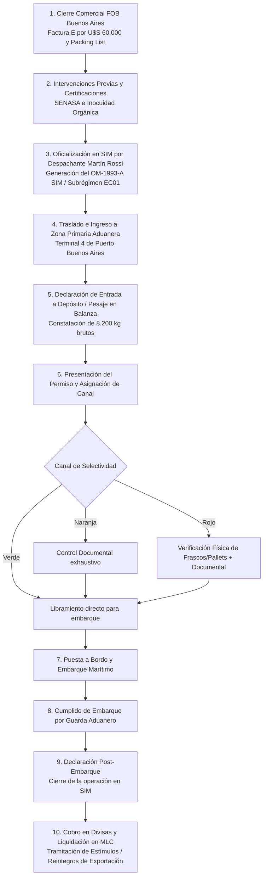

# 🍯 Resolución de la Actividad Práctica: Permiso de Embarque (OM-1993-A SIM)
> **Materia:** Comercio Exterior – UTN  
> **Tema:** Documentación Aduanera de Exportación – Formulario OM-1993-A SIM  
> **Caso:** Exportación Definitiva a Consumo de Miel Orgánica – *Colmenas del Sur S.A.*

---

## 📋 1. Datos del Enunciado

| Concepto | Detalle en el Enunciado | Código / Valor |
| :--- | :--- | :--- |
| **Exportador** | Colmenas del Sur S.A. | CUIT: **30-77788899-2** |
| **Declarante (Despachante)** | Martín Rossi | CUIT: **20-44455566-1** |
| **Aduana de Registro** | Aduana de Buenos Aires | **001** |
| **Destinación / Subrégimen** | Exportación definitiva a consumo | **EC01** |
| **Vía de Transporte** | Marítima | **1** |
| **Aduana de Salida** | Aduana de Buenos Aires (coincide con registro) | **001** |
| **País de Destino Final** | Alemania | **DE** |
| **Lugar de Giro / Depósito** | Terminal 4 del Puerto de Buenos Aires | Zona Primaria Aduanera |
| **Posición Arancelaria (NCM)** | Miel natural en envases ≤ 2 kg | **0409.00.00.100M** |
| **Descripción de la mercadería** | Miel orgánica pura de abeja, multifloral, en frascos de vidrio de 500 g. Marca "Sol de Pampa". | Mercadería nueva sin uso |
| **Condición de Venta (Incoterm)** | FOB Buenos Aires | Entrega sobre buque |
| **Moneda de Facturación** | Dólares Estadounidenses | **DOL** (USD) |
| **Precio Unitario** | Por frasco de 500 gramos | **U$S 4,00** |
| **Cantidad de Unidades** | Frascos | **15.000 U** |
| **Tipo de Bulto** | Pallets | **PL** |
| **Cantidad de Bultos** | 10 pallets (1.500 frascos c/u) | **10** |
| **Peso Neto Total** | Contenido puro de miel (15.000 × 0,5 kg) | **7.500 kg** |
| **Peso Bruto Total** | Miel + envases de vidrio + cajas + tarimas | **8.200 kg** |

---

## 🧮 2. Memoria de Cálculo Previa

Antes de volcar los datos a los casilleros, se realizan las verificaciones cuantitativas:

### 1. Valor FOB Total:
$$\text{Valor FOB Total} = \text{Cantidad de Unidades} \times \text{Precio Unitario FOB}$$
$$\text{Valor FOB Total} = 15.000\text{ frascos} \times \text{U$S } 4,00/\text{frasco} = \mathbf{U$S\ 60.000,00}$$

### 2. Peso Neto Total:
$$\text{Peso Neto} = 15.000\text{ frascos} \times 0,500\text{ kg} = \mathbf{7.500,00\text{ kg}}$$

### 3. Tara Total del Embalaje:
$$\text{Tara Total} = \text{Peso Bruto} - \text{Peso Neto} = 8.200\text{ kg} - 7.500\text{ kg} = \mathbf{700,00\text{ kg}}$$
* Tara promedio por pallet: $700\text{ kg} / 10\text{ pallets} = 70\text{ kg/pallet}$ (incluye frascos de vidrio, tapas, cajas de cartón corrugado, zunchos, film stretch y pallet de madera normalizado).

---

## 📑 3. Resolución: Casilleros del Formulario OM-1993-A SIM

El formulario **OM-1993-A SIM** es la declaración jurada oficial exigida por la Dirección General de Aduanas (AFIP/ARCA) que instrumenta el **Permiso de Embarque**. Se completa en dos bloques fundamentales:

---

### A. Bloque de Carátula (Datos Generales de la Destinación)

| N° Casillero / Campo | Nombre del Campo | Dato / Valor a Consignar | Fundamento y Justificación Técnica |
| :---: | :--- | :--- | :--- |
| **1** | **Aduana de Registro** | **001 - BUENOS AIRES** | Jurisdicción aduanera donde se oficializa la declaración ante el SIM. |
| **2** | **Identificador de la Declaración** | `26 001 EC01 000123 A` *(ejemplo formato SIM)* | Estructura: Año (26) + Aduana (001) + Subrégimen (EC01) + Número + Dígito verificador. |
| **3** | **Destinación / Subrégimen** | **EC01 - EXPORTACIÓN DEFINITIVA A CONSUMO** | Indica que la mercadería sale del territorio aduanero por tiempo indeterminado (Art. 725 Código Aduanero). |
| **4** | **Exportador (Razón Social)** | **COLMENAS DEL SUR S.A.** | Titular de la mercadería, inscripto en el Registro de Importadores y Exportadores de Aduana. |
| **5** | **CUIT del Exportador** | **30-77788899-2** | Clave de identificación tributaria activa y habilitada para operar en comercio exterior. |
| **6** | **Declarante (Despachante)** | **MARTÍN ROSSI** | Agente auxiliar del comercio y del servicio aduanero autorizado por la empresa. |
| **7** | **CUIT del Declarante** | **20-44455566-1** | CUIT del Despachante que suscribe y compromete la declaración aduanera bajo fe de juramento. |
| **8** | **Vía de Transporte** | **1 - MARÍTIMA** | Código aduanero 1 para transporte por agua en buque de ultramar. |
| **9** | **Aduana de Salida** | **001 - BUENOS AIRES** | Aduana por la que egresa físicamente la mercadería (coincide con la de registro). |
| **10** | **País de Destino Final** | **DE - ALEMANIA (República Federal de Alemania)** | Código ISO del país donde la mercadería será nacionalizada y consumida. |
| **11** | **Lugar de Giro / Operación** | **TERMINAL 4 - PUERTO DE BUENOS AIRES** | Depósito / muelle fiscal en zona primaria aduanera donde se presentará la carga para su embarque. |
| **12** | **Condición de Venta (Incoterm)** | **FOB BUENOS AIRES** | "Free On Board" (Libre a Bordo). La responsabilidad del exportador concluye cuando la mercadería sobrepasa la borda y queda estibada a bordo. |
| **13** | **Moneda de Facturación** | **DOL (Dólar Estadounidense)** | Divisa pactada comercialmente en la Factura Proforma y Factura "E". |
| **14** | **Cantidad Total de Bultos** | **10** | Cantidad total de pallets declarada en carátula. |
| **15** | **Tipo de Bultos** | **PL (PALLETS)** | Código de embalaje normalizado SIM para tarimas/paletas. |
| **16** | **Peso Bruto Total** | **8.200,00 kg** | Peso total a verificar en balanza fiscal del puerto. |
| **17** | **Peso Neto Total** | **7.500,00 kg** | Peso comercial neto de la mercadería gravada. |
| **18** | **Valor FOB Total** | **U$S 60.000,00** | Sumatoria del valor FOB de todos los ítems declarados. |

---

### B. Bloque de Ítems (Detalle de la Mercadería)

| N° Casillero / Campo | Nombre del Campo | Dato / Valor a Consignar | Fundamento y Justificación Técnica |
| :---: | :--- | :--- | :--- |
| **1** | **N° de Ítem / Subítem** | **Ítem: 01 / Subítem: 01** | Primer y único ítem de la operación. |
| **2** | **Posición Arancelaria NCM/SIM** | **0409.00.00.100M** | Código del Sistema Armonizado / Mercosur con apertura SIM de 12 caracteres (incluye dígito de control 'M'). |
| **3** | **Descripción Arancelaria NCM** | *Miel natural, en envases con contenido inferior o igual a 2 kg.* | Texto literal de la nomenclatura arancelaria. |
| **4** | **Descripción Comercial Comprometida** | **Miel orgánica pura de abeja, multifloral, en frascos de vidrio de 500 gramos. Marca "Sol de Pampa".** | Declaración jurada detallada de la mercadería: especie, calidad, tipo de envase, peso unitario y marca. |
| **5** | **Estado de la Mercadería** | **N - NUEVO SIN USO** | Estado exigido para mercadería de exportación apta para consumo humano. |
| **6** | **Cantidad de Unidades (Comercial)** | **15.000** | Frascos totales objeto de la transacción. |
| **7** | **Unidad de Medida Comercial** | **U (Unidades)** | Unidad de facturación comercial. |
| **8** | **Cantidad en Unidad Estadística** | **7.500 kg** | En la posición 0409 la unidad estadística de aduana es el kilogramo neto. |
| **9** | **Precio Unitario FOB** | **U$S 4,00 por frasco** | Precio acordado por unidad entregada sobre buque. |
| **10** | **Valor FOB del Ítem** | **U$S 60.000,00** | Base para la liquidación de derechos o cálculo de estímulos a la exportación. |
| **11** | **Tipo y Cantidad de Bultos** | **10 Pallets (PL)** | Cada pallet contiene 1.500 frascos organizados en cajas de cartón. |
| **12** | **Peso Neto del Ítem** | **7.500,00 kg** | $15.000 \times 0,5\text{ kg} = 7.500\text{ kg}$. |
| **13** | **Peso Bruto del Ítem** | **8.200,00 kg** | Peso total del ítem con acondicionamiento para transporte internacional. |
| **14** | **País de Origen** | **AR - ARGENTINA** | País de producción y cosecha apícola. |
| **15** | **País de Procedencia** | **AR - ARGENTINA** | País desde donde se expide la carga. |
| **16** | **País de Destino** | **DE - ALEMANIA** | País receptor final de la mercadería. |
| **17** | **Intervenciones de Organismos** | **SENASA / Certificadora Orgánica (Ley 25.127)** | Emisión de Certificado Sanitario de Inocuidad y Certificado de Conformidad Orgánica para la UE. |

---

## 📦 4. Documentación Complementaria Obligatoria

Conforme a la normativa aduanera argentina (Módulo V de Comercio Exterior), el formulario OM-1993-A SIM debe insertarse en el **Sobre Contenedor OM-2133 SIM (color verde)** debidamente firmado por el declarante, junto a la siguiente documentación de respaldo:

1. **Factura Comercial de Exportación (Factura "E"):**
   * Emitida por Colmenas del Sur S.A. en dólares estadounidenses por **U$S 60.000,00 FOB Buenos Aires**, consignando comprador en Alemania, condición de venta e identificación del lote.
2. **Lista de Empaque (Packing List):**
   * Detalle pormenorizado del contenido de cada uno de los 10 pallets: distribución de las cajas, número de frascos por caja, marcas exteriores de los bultos, pesos netos y pesos brutos individuales y totales.
3. **Documento de Transporte Internacional:**
   * **Conocimiento de Embarque Marítimo (*Bill of Lading* - B/L):** Emitido por la compañía naviera que efectúa el flete ultramarino desde Buenos Aires hasta el puerto alemán de destino (ej. Hamburgo o Bremen). Funciona como contrato de transporte, recibo de carga a bordo y título de propiedad transferible.
4. **Certificado Sanitario y de Calidad de SENASA:**
   * Habilita sanitariamente la salida de miel de consumo apta conforme a las estrictas regulaciones higiénico-sanitarias y límites de residuos exigidos por la Unión Europea.
5. **Certificado de Producto Orgánico Oficial:**
   * Avalado por SENASA y emitido por entidad certificadora reconocida (ej. OIA, Argencert, Letis) según los estándares de la Ley Nacional 25.127 y equivalencia con el Reglamento de la UE.
6. **Certificado de Origen:**
   * Acreditación formal de que la miel es de producción 100% argentina.

---

## 🔄 5. Circuito Operativo y Aduanero de la Exportación

### Canales de Selectividad Aduanera en la Terminal 4:
* **Canal Verde:** No requiere revisión documental ni inspección física aduanera previa a la carga. La mercadería queda autorizada a embarcar de inmediato (*libramiento automático*).
* **Canal Naranja:** El servicio aduanero realiza el cotejo minucioso de la documentación declarada (Factura E, Packing List, certificados de SENASA y OM-1993-A).
* **Canal Rojo:** Control documental y revisión física integral en rampa de inspección aduanera (apertura de cajas, verificación de etiquetas "Sol de Pampa" y concordancia de peso y frascos).

---

## 💡 6. Preguntas Teóricas Clave de Examen

### ¿Qué plazo de validez tiene el Permiso de Embarque una vez oficializado?
El Permiso de Embarque oficializado ante el SIM posee una validez de **31 días corridos** para efectuar el embarque de la mercadería por la vía marítima, prorrogable ante la aduana mediando causas debidamente justificadas.

### ¿Qué ocurre si al cargar en la Terminal 4 se embarcan menos unidades de las declaradas?
Deberá formularse la **Declaración Post-Embarque** en el SIM. El exportador o su despachante rectifica la declaración ajustando la cantidad y valor a lo efectivamente puesto a bordo (según el cumplido del guarda aduanero), a fin de evitar inconsistencias cambiarias ante el BCRA y liquidar los reintegros tributarios sobre el valor real exportado.

---
*Documento preparado conforme al Código Aduanero de la República Argentina (Ley 22.415), normas AFIP/DGA (SIM) y programa de Comercio Exterior – UTN 2026.*
